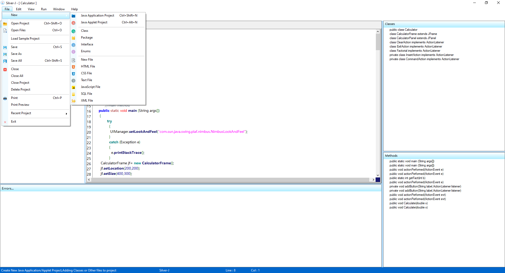

# Integrated Development Environment
A small Java Integrated Development Environment(IDE) written in C#. 
Create Java Application & Java Applet Projects, Compile & Run Projects, Build Executable Jar Applications, Different Appearances etc.

In this project i used ICSharpCode.TextEditor.dll library for syntax highlighting. 
Download it here 
&nbsp;&nbsp;&nbsp;&nbsp;  https://www.nuget.org/packages/ICSharpCode.TextEditor/

